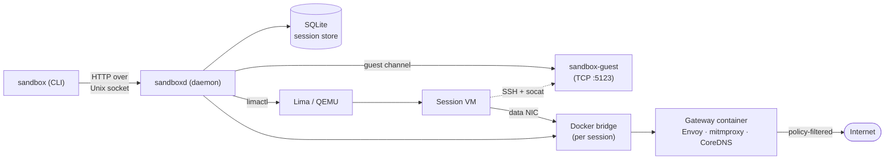

This page gives you a high-level overview of sandboxd's architecture. For the CLI surface, see the [CLI reference](/reference/cli/). For the full end-to-end install path, see [Installation](/start/installation/).

## Components at a glance



The diagram shows three traffic paths: the control path (CLI → daemon → guest agent for commands and files), the VM lifecycle path (daemon → Lima → QEMU VM), and the data path (VM → Docker bridge → gateway → internet).

### sandboxd (daemon)

The central process that manages the full sandbox lifecycle. It listens on a Unix socket for HTTP API requests and coordinates all other components.

Responsibilities:

- Create, start, stop, and remove sessions.
- Manage Lima VMs (create, start, stop, delete).
- Set up and tear down per-session networking (Docker bridge, gateway container, bridge NIC via `qemu-bridge-helper`).
- Generate and inject per-session CA certificates.
- Compile and distribute network policies to gateway components.
- Relay command execution, file transfer, and git operations to the guest agent.
- Maintain a SQLite database of sessions and their network info.
- Run background DNS propagation loops that update nftables rules as DNS resolutions change.

Key modules (in `sandbox-core`):

- `SessionStore` — SQLite-backed session persistence.
- `LimaManager` — drives `limactl` for VM lifecycle operations.
- `GuestConnector` — communicates with the guest agent over TCP via SSH tunnel (`limactl shell ... socat - TCP:127.0.0.1:5123`).
- `NetworkManager` — manages Docker bridge networks and subnet allocation.
- `GatewayManager` — creates and monitors gateway containers.
- `CaManager` — generates and manages per-session CA certificates.
- `PolicyCompiler` — transforms policy rules into component-specific configurations.
- `PolicyDistributor` — pushes compiled configurations to gateway components.

### sandbox (CLI)

A thin client that builds HTTP requests and sends them to the daemon over the Unix socket. Most commands map directly to a single API call.

Commands handled via the HTTP API: `create`, `start`, `stop`, `rm`, `ps`/`ls`, `exec`, `policy update`, `health`.

Commands handled specially:

- `ssh` — resolves the session via the API, then invokes `limactl shell` directly.
- `logs` — resolves the session via the API, then invokes `docker logs` or `docker exec` to read gateway logs.
- `cp` — reads/writes local files and transfers via the daemon's upload/download API endpoints.

The same binary is also installed as a `git-remote-sandbox` symlink. When git invokes it under that name for a `sandbox::` URL, it acts as a git remote helper and spawns `sandbox ssh <session>` to tunnel the git pack protocol to `git-upload-pack` / `git-receive-pack` inside the VM.

### sandbox-guest (VM agent)

A lightweight binary running inside each VM that listens on TCP port 5123 (localhost only). The daemon communicates with it through `limactl shell` (SSH tunnel) piped to `socat` to bridge stdin/stdout to the agent's TCP port. Lima does not support kernel AF_VSOCK, so TCP-over-SSH is used instead.

Supported operations:

- Ping (liveness check).
- Command execution (arbitrary command + args, returns stdout/stderr/exit code).
- File upload (base64-encoded data written to a path).
- File download (read a path, return base64-encoded data).
- Git upload-pack and receive-pack (relay git protocol streams).

### sandbox-core (shared library)

Contains all shared types, configuration structures, and business logic used by both the daemon and CLI:

- API request/response types (`CreateSessionRequest`, `ExecRequest`, `ExecResponse`, etc.).
- Session model (`Session`, `SessionConfig`, `SessionState`, `SessionResponse`).
- Policy types (`Policy`, `Rule`, `AssuranceLevel`, `Constraints`).
- Error types (`SandboxError`, `ApiError`).
- Infrastructure managers (`LimaManager`, `NetworkManager`, `GatewayManager`, `CaManager`).
- Policy compilation and distribution.

### Gateway container

A Docker container running per session that mediates all outbound traffic from the VM. It bundles three components:

| Component | Role |
|-----------|------|
| **Envoy** | L4/L7 proxy that routes connections based on policy assurance levels |
| **mitmproxy** | HTTPS interceptor for full-inspection (level 3) traffic |
| **CoreDNS** | DNS server with policy filtering (blocks disallowed domains) |

The gateway also runs nftables rules in its network namespace to enforce deny-by-default firewall behavior and DNAT traffic into the proxy pipeline.

## Session lifecycle

A session moves through these states:

```text
                                             +---------+
                                             |         |
  create --> Creating --> Running <---------> Stopped   |
                            |                    |     |
                            |  rm                |  rm |
                            +---> (deleted) <----+     |
                            |                          |
                            +--> Error ----------------+
```

### Create

1. **Session record.** A new session is created in the SQLite database with state `Creating`.
2. **CA + Networking.** The per-session CA certificate is generated. A per-session Docker bridge network is created (the bridge must exist before VM boot so `qemu-bridge-helper` can attach the NIC).
3. **Lima VM.** A QEMU/KVM virtual machine is created and booted via `limactl`. An auto-generated Lima YAML template configures CPU, memory, disk, and firmware settings. The bridge NIC is attached at boot time via `qemu-bridge-helper` (no QMP hot-add). If `--template` is provided, the custom template is used instead.
4. **Guest agent.** The `sandbox-guest` binary is copied into the VM and started. The daemon verifies connectivity with a ping.
5. **Gateway + Network config.** The gateway container is created on the Docker bridge. The VM's bridge NIC is configured with a static IP via the guest agent. The CA certificate is injected into the VM's trust store.
6. **State transition.** Session state moves to `Running`.
7. **Policy.** If `--policy` was provided, the policy is compiled and distributed to gateway components. A DNS propagation loop is started.
8. **Workspace.** If `--repo` was provided, the repository is cloned into `/home/agent/workspace/`. If `--workspace shared:<path>` was provided, the host directory is mounted via 9p.
9. **Boot command.** If `--boot-cmd` was provided, it is executed via the guest agent.

### Stop

1. Cancel the DNS propagation loop.
2. Stop the Lima VM (the TAP device, owned by QEMU, is destroyed automatically).
3. Tear down networking (stop gateway container, remove Docker bridge). The subnet allocation and CA certificate are preserved.
4. Session state moves to `Stopped`.

### Start (resume)

1. Start the Lima VM.
2. Verify guest agent connectivity.
3. Session state moves to `Running`.
4. Restore networking from the stored network info (same subnet, same IPs).
5. Re-inject the CA certificate into the VM.

### Remove

1. Cancel the DNS propagation loop.
2. Stop the VM if running.
3. Delete the Lima instance.
4. Full networking teardown (including subnet release and CA deletion).
5. Delete the session from the database.

## Data flow

### CLI to daemon

All communication between the CLI and daemon uses HTTP/1.1 over a Unix domain socket. The daemon uses Axum to route requests.

```text
sandbox exec my-vm -- ls /root
    |
    +-- HTTP POST /sessions/my-vm/exec  {"command":"ls","args":["/root"]}
    |       (over Unix socket)
    v
sandboxd receives request
    |
    +-- GuestConnector.exec(session_id, "ls", ["/root"])
    |       (via limactl shell -> SSH -> socat -> TCP:5123 -> guest agent)
    v
sandbox-guest executes "ls /root"
    |
    +-- returns stdout, stderr, exit_code
    v
sandboxd returns HTTP 200 {"exit_code":0,"stdout":"...","stderr":""}
    |
    v
sandbox prints stdout, exits with code 0
```

### API routes

| Method | Path | Handler | Description |
|--------|------|---------|-------------|
| POST | `/sessions` | `create_session` | Create a new session |
| GET | `/sessions` | `list_sessions` | List all sessions |
| GET | `/sessions/{id}` | `get_session` | Get a single session |
| DELETE | `/sessions/{id}` | `remove_session` | Remove a session |
| POST | `/sessions/{id}/start` | `start_session` | Start a stopped session |
| POST | `/sessions/{id}/stop` | `stop_session` | Stop a running session |
| POST | `/sessions/{id}/exec` | `exec_in_session` | Execute a command |
| POST | `/sessions/{id}/upload` | `upload_to_session` | Upload a file |
| POST | `/sessions/{id}/download` | `download_from_session` | Download a file |
| POST | `/sessions/{id}/policy` | `update_policy` | Update network policy |
| GET | `/sessions/{id}/health` | `session_health` | Per-session health |
| GET | `/health` | `health_check` | Global health |
| POST | `/rebuild-image` | `rebuild_image` | Rebuild the pre-baked base VM image |
| GET | `/base-image-status` | `base_image_status` | Check base image build status |

The `{id}` parameter accepts a session's human-readable name, its full 12-character hex session ID, or any unique prefix of the session ID (Docker-style). See [CLI reference](/reference/cli/) for details.

## Security model

### VM isolation

Each session runs in a separate QEMU/KVM virtual machine. The VM provides hardware-level isolation — processes inside the VM cannot access host memory, filesystems, or other VMs.

QEMU hardening is enabled by default (disabled with `--no-hardening`):

- **Device lockdown** — unnecessary virtual devices are disabled.
- **Seccomp sandboxing** — the QEMU process is restricted to the minimum set of system calls.

### Network isolation

Each session gets its own Docker bridge network. There is no cross-session traffic path. The gateway container sits on the session's bridge and has no access to the host network or other sessions.

All outbound traffic from the VM passes through the gateway's proxy pipeline. The VM cannot bypass this — its single data NIC routes through the Docker bridge, and nftables deny-all rules block any traffic that does not match the proxy pipeline.

### TLS interception

A per-session CA is generated for each session. The CA private key exists only in the gateway container (never in the VM). mitmproxy uses the CA to perform HTTPS inspection for level 3 (full) policy rules. Each session's CA is independent — compromise of one does not affect others.

### Default-deny networking

Without a policy, all outbound network traffic is blocked. DNS queries return `NXDOMAIN` for all domains. Only explicitly allowed destinations (by policy rules) can be reached.

## Storage

### SQLite database

The daemon stores session metadata in a SQLite database at `<base-dir>/sessions.db`. The database contains:

- Session records (ID, name, state, config, timestamps).
- Network info per session (subnet, IPs, Docker network name, TAP name).

Migrations are managed by the `refinery` crate and run automatically at daemon startup.

### Per-session directories

Each session has a directory at `<base-dir>/sessions/<session-id>/` containing:

- `ca/` — per-session CA certificate files (`cert.pem`, `key.pem`, `mitmproxy-ca.pem`, `mitmproxy-ca-cert.pem`).

### Lima data

Lima stores its own VM data under `~/.lima/sandbox-<session-id>/`. This includes the VM disk image, configuration, and SSH keys.
