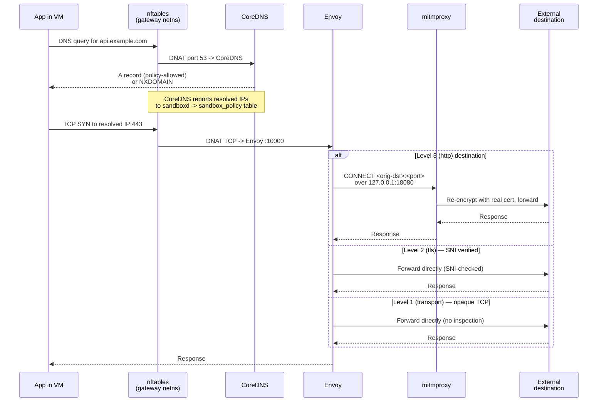

Every sandbox session gets its own network stack with a single exit: the gateway container. This page explains the model — what exists, why, and how a packet travels from inside the VM to the internet. For hands-on rule writing, see [network policies](/guides/network-policies/).

## The model in one picture

Each session is a closed loop:

- A **per-session Docker bridge** (a `/28` subnet) — the only L2 segment the VM touches.
- A **gateway container** attached to that bridge — the only L3 next hop the VM can reach.
- Inside the gateway: **nftables** for default-deny firewalling and conditional DNAT, **CoreDNS** for policy-filtered DNS, **Envoy** for connection routing, **mitmproxy** for TLS inspection, and a **deny-logger** that catches traffic no allow rule matched.
- A **per-session CA** trusted inside the VM, with the private key living only inside the gateway.

There is no alternate path out for application traffic. The VM's data NIC routes through the gateway, and the gateway denies everything by default.

## The two NICs: management vs. data plane

Each VM has two network interfaces, with very different roles:

| Interface | Type | Carries | Reaches |
|---|---|---|---|
| `eth0` | SLIRP (QEMU user-mode networking) | Lima's SSH management channel | The host, via QEMU's in-process TCP/IP stack |
| `eth1` | TAP on the per-session Docker bridge | All application traffic | The gateway container — and nothing else |

`eth0` exists because Lima needs an SSH channel to the VM and SLIRP provides one without requiring TAP devices or root on the host. It is **not** a path for user workloads: the guest installs a default route over `eth1` with a lower metric than SLIRP's, so any `connect()` from an application inside the VM goes out through the gateway, not through SLIRP. The SLIRP interface is effectively invisible to applications running inside the VM.

This matters for the threat model: the policy layer (DNS filtering, nftables, Envoy, mitmproxy) applies to traffic that reaches the gateway. That covers the entire data plane by construction. SLIRP carries only the Lima management channel; it doesn't and can't carry application traffic to arbitrary internet destinations. See [SLIRP management network](/guides/hardening/#slirp-management-network) in the hardening guide for the trade-offs this design makes.

## Per-session isolation

### One bridge per session

When you create a session, sandboxd allocates a `/28` subnet from a configurable base (default `10.209.0.0/24`). A `/24` holds 16 concurrent sessions.

| Address in the `/28` | Role |
|---|---|
| `.1` | Docker bridge gateway (the bridge itself) |
| `.2` | Gateway container |
| `.3` | VM data NIC |
| `.4`–`.14` | Unused |

Because each session has its own bridge — a separate L2 segment — sessions cannot see each other's traffic. The gateway container attaches only to that session's bridge, so it has no visibility into the host network or other sessions either.

### The naming scheme

Session IDs are 12 lowercase hex characters, chosen so the derived network-resource names fit Linux's 15-character interface name limit exactly:

| Resource | Name |
|---|---|
| Docker network | `sandbox-net-{session_id}` |
| Bridge interface | `sb-{session_id}` (3 + 12 = 15) |
| Gateway container | `sandbox-gw-{session_id}` |
| TAP device | `tb-{session_id}` (3 + 12 = 15) |

## The gateway

The gateway container is the session's single exit. It runs four cooperating processes plus an nftables ruleset in its own network namespace.

### nftables

The gateway holds three nftables tables, each with a distinct role:

| Table | Purpose |
|---|---|
| `sandbox` | Deny-all baseline — forward chain drops everything |
| `sandbox_dnat` | PREROUTING DNAT — DNS to CoreDNS; policy-allowed TCP/UDP conditionally to Envoy, everything else to the deny-logger |
| `sandbox_policy` | Envoy-egress allow list — IPs learned from DNS responses plus policy CIDRs |

`sandbox_dnat` carries two concat sets, `policy_allow_tcp` and `policy_allow_udp`, keyed on `(destination-IP, destination-port)`. PREROUTING packets whose `(daddr, dport)` is in the set are DNAT-redirected to Envoy's intercepting listener on `127.0.0.1:10000`; packets outside the set (TCP **or** UDP) are redirected to the deny-logger on `127.0.0.1:10001` (TCP) / `127.0.0.1:10002` (UDP). The deny-logger records the pre-DNAT 5-tuple (see the `deny` event under [`sandbox events`](/reference/cli/#sandbox-events)) and closes TCP with `SO_LINGER{1,0}` so the VM sees a RST immediately instead of a silent hang.

The deny-all baseline in the `sandbox` table is the safety net: even if `sandbox_dnat` disappeared, no forwarded packet would leave the namespace. Level-3 (HTTPS inspection) traffic is not routed through nftables DNAT a second time; Envoy itself opens a loopback CONNECT tunnel to mitmproxy on `127.0.0.1:18080` (see [Request flow](#request-flow) below).

### Four processes

| Component | What it does |
|---|---|
| **CoreDNS** | Answers all DNS queries; returns `NXDOMAIN` for anything the policy does not list |
| **Envoy** | Receives redirected TCP; routes connections per the policy's assurance level |
| **mitmproxy** | Terminates TLS with the per-session CA for HTTP-level inspection |
| **deny-logger** | TCP `:10001`, UDP `:10002`, healthcheck `:10003`; recovers the pre-DNAT destination via `SO_ORIGINAL_DST` / `IP_ORIGDSTADDR` and emits a structured `deny` event per attempt |

Startup is ordered to avoid a window where traffic could leak: deny-logger and mitmproxy come up first, then Envoy, then CoreDNS. The DNAT rules in `sandbox_dnat` are installed only after all four pass their readiness checks.

### Why a container, not the host

Running the gateway as a container keeps the daemon userland: sandboxd itself needs no root, no sudo, no host-level nftables access. The gateway has `CAP_NET_ADMIN` only inside its own network namespace, and the daemon edits rules with `docker exec nft` — not via privileged host tooling.

## Request flow

On the Level 3 path, Envoy routes the TCP flow into its `mitmproxy` upstream cluster with a per-chain `tcp_proxy.tunneling_config` whose hostname is `%DOWNSTREAM_LOCAL_ADDRESS%` — the original destination recovered from `SO_ORIGINAL_DST` on the intercepting listener. That produces an HTTP/1.1 `CONNECT <orig-ip>:<port>` request to mitmproxy on `127.0.0.1:18080`, which runs in regular forward-proxy mode. mitmproxy terminates TLS inside the tunnel with the per-session CA, inspects the request, and re-establishes a verified TLS connection to the real destination. mitmproxy is bound to loopback only; the VM cannot reach it directly.

L3 filter-chain selection is **port-explicit**: Envoy's chain `filter_chain_match` predicate carries both a `prefix_ranges` list (the destination IPs learned for the rule's host) *and* a `destination_port`. A connection whose `(dst_ip, dst_port)` does not match both is passed to no L3 chain — it is dropped. That mirrors the v2 policy shape (every rule declares an explicit port), so an `api.example.com:443` rule does not inadvertently open `api.example.com:80`.

When mitmproxy matches the request against a rule's `http_filters`, the path is stripped of its query string first — the matcher sees `/api/v1/resource`, not `/api/v1/resource?token=abc&redirect=...`. A `GET /api/v1/**` filter therefore matches the request regardless of what the caller appended after `?`. The full path (query string included) is still logged on the `request_allowed` / `request_denied` event so operators can see what the caller actually sent.

Two things are worth highlighting:

- **DNS is intercepted twice.** The VM's `resolv.conf` points at the gateway, *and* nftables DNATs port 53 regardless of destination. An application that ignores `resolv.conf` and hardcodes `8.8.8.8` still ends up at CoreDNS.
- **Direct-IP access is not a loophole.** Even if an application skips DNS and dials an IP directly, its `(daddr, dport)` must be in `policy_allow_{tcp,udp}` (populated from policy CIDRs plus CoreDNS-learned IPs for the matching rule's port) for the DNAT to Envoy to fire. Anything else is redirected to the deny-logger, which records the attempt and RST-closes the flow.

## DNS

CoreDNS is the only resolver the VM reaches.

- **With a policy applied**, CoreDNS answers only the domains the policy lists; everything else returns `NXDOMAIN`. ECH/HTTPS SVCB records are stripped from answers so Encrypted Client Hello cannot hide the hostname from downstream inspection.
- **Without a policy**, DNS resolution returns `NXDOMAIN` for everything — the default is deny.
- **IPs learned from CoreDNS** are reported back to sandboxd, which writes them into the `sandbox_policy` table so the firewall matches the live IPs for each allowed domain.

### Fail-closed propagation for Level 3

Level-3 (HTTPS-inspected) destinations are selected by matching the connection's original destination IP *and* port against per-chain `prefix_ranges` + `destination_port` on Envoy's filter chains. Those IPs come from the same DNS learning loop that drives `sandbox_policy`: when CoreDNS answers a policy-allowed name, sandboxd rewrites the Envoy listener file and Envoy picks up the new chain via xDS.

The propagation is **fail-closed**, not fail-open:

- Between the moment CoreDNS answers and the moment Envoy's listener is updated (sub-second in practice, but non-zero), the destination IP has no matching L3 filter chain. A connection to it during that window hits no chain and is dropped by Envoy — it is **not** silently forwarded as passthrough.
- An application that dials an IP literal it learned out-of-band, or uses a stale cached DNS answer after a policy change that removed the name, will also fail closed for the same reason.

The practical consequence is that the very first request to a brand-new L3 destination, issued immediately after a `policy update`, can race the propagation loop and be refused. Retrying — or warming DNS with a prior lookup — closes the race. See [troubleshooting](/guides/troubleshooting/#l3-destination-fails-on-first-request-after-policy-change) for the operator-side view of this.

The propagation loop publishes a `policy_propagated` lifecycle event once all three enforcement layers (CoreDNS, nftables `policy_allow_{tcp,udp}` sets, and Envoy's L3 filter chains) have reconciled to the latest applied policy. The event carries `policy_hash`, the SHA-256 hex digest of the canonical JSON form of the effective policy, and is emitted only on hash transitions (so a steady state produces no repeat events). Scripts that need to wait for the new policy to be live can observe that event via `sandbox events --event policy_propagated --follow`, or invoke `sandbox policy status --wait` to block until the hash transitions.

### Event attribution

Every policy-enforcing component emits structured events that sandboxd ingests and publishes on a per-session ring buffer. Most layers carry the VM's bridge IP on the record, and sandboxd stamps the envelope `session` by looking up `(vm_ip → session_id)` at ingest time. mitmproxy is the exception: by the time a request reaches the addon, the TCP peer is Envoy's loopback-connect source, not the VM. So the mitmproxy ingestor attributes its events to the **per-session watcher** that produced the line — one watcher per session, reading that session's mitmproxy JSONL log — rather than via the VM-IP map. Deny-logger events use the pre-DNAT `src_ip` from `SO_ORIGINAL_DST` / `IP_ORIGDSTADDR`, which is the VM's bridge IP, and go back through the VM-IP map. See [`sandbox events`](/reference/cli/#sandbox-events) for the replay/stream surface.

## TLS interception

The sandbox inspects HTTPS traffic at the highest policy level by generating a per-session CA and letting mitmproxy man-in-the-middle intercepted flows.

### Per-session CA

At session creation, sandboxd generates an ECDSA P-256 CA. The CA's Common Name is `Sandbox CA {session_id}`. CA files live in the session's state directory and are bind-mounted read-only into the gateway.

The **private key never enters the VM.** The VM receives only the public certificate, installed in:

- The system trust store (`/usr/local/share/ca-certificates/`, refreshed with `update-ca-certificates`).
- Per-language trust-store environment variables (`SSL_CERT_FILE`, `REQUESTS_CA_BUNDLE`, `NODE_EXTRA_CA_CERTS`, `CURL_CA_BUNDLE`).
- The Docker daemon trust store inside the VM, for registry pulls.

Each session uses its own CA. Compromise of one session's CA does not affect others.

### What breaks under interception

Applications that pin certificates — or ship a private trust store — will reject the session CA. Those destinations need a lower assurance level (`tls` or `transport`) that skips MITM. See [policy model](/concepts/policy-model/) for what each level does.

## Lifecycle implications

Networking is created and destroyed with the session, in a specific order:

- **Create.** CA first, then the Docker bridge, then the gateway container with deny-all rules, then readiness, then DNAT rules, then the VM itself.
- **Stop.** VM down, gateway down, bridge removed. The subnet allocation and the CA are preserved so `start` can restore the same addressing and trust chain.
- **Start.** The stored subnet and IPs are reused; a new gateway container is created with the existing CA.
- **Remove.** Everything released, including the CA files.

See [sessions](/concepts/sessions/) for the broader lifecycle picture.

## Related reading

- [Policy model](/concepts/policy-model/) — how assurance levels map onto the components above.
- [Architecture](/concepts/architecture/) — how the gateway fits into the rest of the system.
- [Network policies guide](/guides/network-policies/) — authoring and applying rules.
- [Hardening](/guides/hardening/) — the security properties this network model enforces.
- [Troubleshooting](/guides/troubleshooting/) — diagnosing network failures in a running session.
