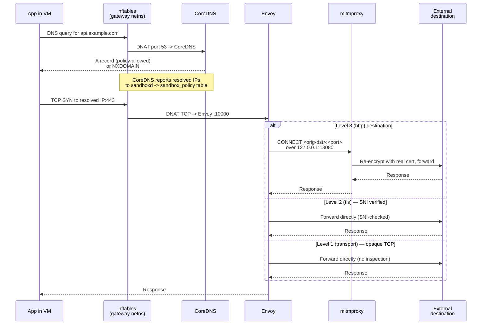

Every sandbox session gets its own network stack with a single exit: the gateway container. This page explains the model — what exists, why, and how a packet travels from inside the VM to the internet. For hands-on rule writing, see [network policies](/sandboxd/guides/network-policies/).

## The model in one picture

Each session is a closed loop:

- A **per-session Docker bridge** (a `/28` subnet) — the only L2 segment the VM touches.
- A **gateway container** attached to that bridge — the only L3 next hop the VM can reach.
- Inside the gateway: **nftables** for default-deny firewalling and conditional DNAT, **CoreDNS** for policy-filtered DNS, **Envoy** for connection routing, **mitmproxy** for TLS inspection, an **nft-deny-logger** that catches traffic no allow rule matched, and an **nft-allow-logger** that records every new allowed UDP flow.
- A **per-session CA** trusted inside the VM, with the private key living only inside the gateway.

There is no alternate path out for application traffic. The VM's data NIC routes through the gateway, and the gateway denies everything by default.

## The two NICs: management vs. data plane

Each VM has two network interfaces, with very different roles:

| Interface | Type | Carries | Reaches |
|---|---|---|---|
| `eth0` | SLIRP (QEMU user-mode networking) | Lima's SSH management channel | The host, via QEMU's in-process TCP/IP stack |
| `eth1` | TAP on the per-session Docker bridge | All application traffic | The gateway container — and nothing else |

`eth0` exists because Lima needs an SSH channel to the VM and SLIRP provides one without requiring TAP devices or root on the host. It is **not** a path for user workloads: the guest installs a default route over `eth1` with a lower metric than SLIRP's, so any `connect()` from an application inside the VM goes out through the gateway, not through SLIRP. The SLIRP interface is effectively invisible to applications running inside the VM.

This matters for the threat model: the policy layer (DNS filtering, nftables, Envoy, mitmproxy) applies to traffic that reaches the gateway. That covers the entire data plane by construction. SLIRP carries only the Lima management channel; it doesn't and can't carry application traffic to arbitrary internet destinations. See [SLIRP management network](/sandboxd/guides/hardening/#slirp-management-network) in the hardening guide for the trade-offs this design makes.

## Per-session isolation

### One bridge per session

When you create a session, sandboxd allocates a `/28` subnet from a configurable base (default `10.209.0.0/24`). A `/24` holds 16 concurrent sessions. The dev-install template at `contrib/users.conf.example` overrides this to `10.209.0.0/20` (256 concurrent sessions) for additional headroom; either works because `users.conf` overrides the in-code default.

| Address in the `/28` | Role |
|---|---|
| `.1` | Docker bridge gateway (the bridge itself) |
| `.2` | Gateway container |
| `.3` | VM data NIC |
| `.4`–`.14` | Unused |

Because each session has its own bridge — a separate L2 segment — sessions cannot see each other's traffic. The gateway container attaches only to that session's bridge, so it has no visibility into the host network or other sessions either.

### The naming scheme

Session IDs are 12 lowercase hex characters. Every per-session resource has a fixed name shape derived from the session id:

| Resource | Name | Anchor |
|---|---|---|
| Docker network | `sandbox-net-{session_id}` | reaper/parser symmetry |
| Bridge interface | `sb-{session_id}` (3 + 12 = 15) | IFNAMSIZ |
| Gateway container | `sandbox-gw-{session_id}` | reaper/parser symmetry |
| TAP device | `tb-{session_id}` (3 + 12 = 15) | IFNAMSIZ |
| Lima VM / lite container | `sandbox-{session_id}` | reaper/parser symmetry |
| Per-session home volume | `sandbox-home-{session_id}` | reaper/parser symmetry |

Two distinct constraint chains pin these names. Refactors that touch a prefix or the session-id width must understand which chain they're crossing — the failure modes are different, and both are silent.

#### IFNAMSIZ anchor — `sb-{12hex}` and `tb-{12hex}`

Linux caps kernel network-interface names at **15 bytes** (`IFNAMSIZ - 1` = 15 bytes for the C string + NUL). The bridge and TAP names sit exactly at that limit: `sb-` (3) + 12 hex (12) = 15, and the same for `tb-`. The bridge name is *not* Docker's auto-derived `br-<network-id>` name — sandboxd passes `com.docker.network.bridge.name=sb-{session_id}` on `docker network create` to force the kernel-visible name.

This anchor pins three things together:

- The session-id width at exactly 12 hex characters. Shorter risks identity collisions; longer overflows IFNAMSIZ.
- The `sb-` and `tb-` prefixes at exactly 3 characters. Any longer prefix overflows IFNAMSIZ.
- The total length at exactly 15. Length tests (`network.rs:805-813` for the bridge, `qmp.rs:451-459` for the TAP) catch the math at compile-and-test time, not at `docker network create` time.

**Refactor warning.** Lengthening the `sb-` or `tb-` prefix, or widening the session id past 12 hex, will overflow IFNAMSIZ and silently break `docker network create` (Docker rejects the label) or NIC hot-add. The failure manifests at session-creation time in production; the unit tests above will catch it earlier.

#### Reaper/parser symmetry anchor — `sandbox-{12hex}`, `sandbox-net-{12hex}`, `sandbox-home-{12hex}`

The lite container, the Lima VM, the per-session Docker network, and the home volume all live in the `sandbox-` namespace, but they're distinguished by their second-segment prefix. The orphan reaper (`sandbox-core/src/backend/orphan_reaper.rs`) lists every Docker resource matching `name=sandbox-` and reaps the ones whose name decodes to a valid 12-hex session id absent from `sessions.db`. It uses three hardcoded prefix constants:

- `parse_container_session_id` (delegates to `lima.rs::parse_session_id_from_name`, reused so the VM, the lite container, and the canonical `RuntimeHandle` all share the exact same naming check) — strips `sandbox-` and parses the remaining 12 hex chars. Names that don't decode (e.g. `sandbox-gw-{id}`, `sandbox-home-{id}`, `sandbox-net-{id}`) are intentionally rejected so the reaper doesn't touch them.
- `HOME_VOLUME_PREFIX = "sandbox-home-"` (`orphan_reaper.rs:61`) — strip-and-parse for home volumes.
- `NETWORK_PREFIX = "sandbox-net-"` (`orphan_reaper.rs:65`) — strip-and-parse for networks.

These prefixes are *not* IFNAMSIZ-bound — they're Docker resource names, not kernel interface names, so they can be arbitrary length without breaking network creation. What pins them is producer/consumer agreement: every producer (`container.rs::container_name`, `container.rs::home_volume_name`, `network.rs::create_network`, `lima.rs::vm_name`) must format names with the exact same prefix the reaper strips. The gateway container is the explicit exception — its `sandbox-gw-` prefix decodes to nothing under the lite-container parser, which is the contract that keeps the reaper from clobbering live gateway containers.

**Refactor warning.** Changing any of these prefixes on the producer side without updating the reaper desynchronizes the two. The failure mode depends on direction:

- *Producer prefix narrows or shifts* (e.g. `sandbox-` → `sb-`) — the reaper's `--filter name=sandbox-` no longer lists the producer's resources, so orphans accumulate forever and the reap pass silently does nothing. The daemon doesn't know it's leaking.
- *Reaper prefix narrows or shifts* without the producer following — the reaper's parser stops decoding live names; same outcome (silent leak).
- *Producer/reaper agree on a wider namespace* (e.g. both move from `sandbox-` to `sb-`) — works, but only if every parser, filter, and test is updated atomically. The fact that `parse_session_id_from_name` is shared between the Lima VM, the lite container, and the reaper makes this a single edit point — that sharing is load-bearing.
- *Reaper prefix widens to a superset that the producer doesn't own* — the reaper would try to reap operator-created resources it shouldn't touch.

The current contract is that `sandbox-` is the namespace root, the second segment selects the resource kind (no second segment = VM/container, `gw-` = gateway, `net-` = network, `home-` = volume), and the suffix is always a 12-hex session id. Stay inside that shape.

#### Dual-anchor enforcement (CIDR pool)

The name-prefix anchor above is the first ownership check the reaper runs: "name says sandboxd's." On a host running a single sandboxd that is sufficient. On a host running two sandboxds — prod plus a dev test, two parallel test runs, a dev build coexisting with a stale prod prefix — it is not, because every sandboxd uses the same `sandbox-`, `sandbox-home-`, and `sandbox-net-` prefixes. Without a second anchor each daemon's reaper would mass-delete the other's resources on next boot.

The second anchor is the daemon's `NetworkManager` allocator pool. The pool is resolved from `users.conf` at startup (`sandboxd/sandboxd/src/main.rs::resolve_allocation_pool`) and pinned for the lifetime of the daemon. Networks whose IPAM-reported IPv4 subnets do not lie fully inside the pool are skipped — "name says sandboxd's, *and* CIDR says **this** sandboxd's." Containers and home volumes inherit the gate transitively: if a network for a given session id is not reapable under the CIDR check, the matching `sandbox-{id}` and `sandbox-home-{id}` resources are also left alone.

The CIDR check is fail-closed. Networks with no IPv4 IPAM data, malformed `docker network inspect` output, partial in-pool overlap (e.g. one /28 in-pool, one /28 out-of-pool), or any IPv4 subnet outside the pool are all skipped — the reaper removes only what it can prove is `this sandboxd's`. The inverse rule (reaping on partial in-pool overlap or trusting an empty IPAM block as in-pool) would let a transient `docker network inspect` hiccup mass-delete a neighboring sandboxd's resources, which is the exact failure mode this anchor exists to prevent.

#### Threat model — multi-daemon co-existence

A misconfigured second sandboxd on the same host cannot mass-delete this sandboxd's resources. The CIDR anchor scopes the reaper's reach to the daemon's own allocator pool; any operator who runs two daemons must give each its own pool (operationally, a separate `users.conf` subnet). Two daemons sharing the same pool will still collide at allocation time — that is an operator configuration gap (`docs/operator/`, future), not a kernel-level isolation property. Kernel-level packet-path isolation between two sandboxds on the same host is out of scope for the reaper anchor; this is metadata-only.

#### Cross-references

- Producer: `sandbox-core/src/lima.rs::vm_name` and `VM_NAME_PREFIX` (also reused for the lite container's name).
- Producer: `sandbox-core/src/backend/container.rs::home_volume_name` and the `format!("sandbox-{session_id}")` literal at `container.rs:438`.
- Producer: `sandbox-core/src/network.rs::create_network` (sets `bridge_name = "sb-{session_id}"`, `docker_network_name = "sandbox-net-{session_id}"`, and the `com.docker.network.bridge.name` label).
- Producer: `sandbox-core/src/qmp.rs::tap_name_for_session`.
- Authoritative parser: `sandbox-core/src/lima.rs::parse_session_id_from_name`.
- Reaper consumers: `sandbox-core/src/backend/orphan_reaper.rs::parse_container_session_id` (delegates to the lima parser), `parse_home_volume_session_id`, `parse_network_session_id`, plus the `HOME_VOLUME_PREFIX` and `NETWORK_PREFIX` constants.
- Length guards: `network.rs:805-813` (bridge IFNAMSIZ), `qmp.rs:451-459` (TAP IFNAMSIZ).
- Dual-anchor enforcement: `sandbox-core/src/backend/orphan_reaper.rs::DockerOps::inspect_network_ipam` and `ipam_subnets_in_pool` are the IPAM probe and CIDR-pool gate; the daemon-startup wiring lives at `sandboxd/sandboxd/src/main.rs` (the `reap_orphans` call alongside the resolved `allocation_pool`).

## The gateway

The gateway container is the session's single exit. It runs five cooperating processes plus an nftables ruleset in its own network namespace.

### nftables

The gateway holds three nftables tables, each with a distinct role:

| Table | Purpose |
|---|---|
| `sandbox` | Deny-all baseline — forward chain drops everything |
| `sandbox_dnat` | PREROUTING — DNS to CoreDNS; policy-allowed TCP DNATs to Envoy; policy-allowed UDP exits direct to upstream; non-allowed TCP DNATs to the nft-deny-logger; non-allowed UDP is dropped at nft (with NFLOG copy for audit) |
| `sandbox_policy` | Envoy-egress allow list — IPs learned from DNS responses plus policy CIDRs |

`sandbox_dnat` carries two concat sets, `policy_allow_tcp` and `policy_allow_udp`, keyed on `(destination-IP, destination-port)`. The two protocols take different paths after the set match:

- **TCP.** PREROUTING packets whose `(daddr, dport)` is in `policy_allow_tcp` are DNAT-redirected to Envoy's intercepting listener on `127.0.0.1:10000`; everything else is redirected to the nft-deny-logger on `127.0.0.1:10001`. The nft-deny-logger recovers the pre-DNAT destination via `SO_ORIGINAL_DST` on the accepted socket and closes the connection with `SO_LINGER{1,0}` so the VM sees a RST immediately instead of a silent hang.
- **UDP.** PREROUTING packets whose `(daddr, dport)` is in `policy_allow_udp` `accept` and fall through to MASQUERADE — they exit the gateway directly to upstream, with no userland hop. Anything else hits an `nft log group 1 ; drop` rule: the kernel emits a netlink message carrying the original 5-tuple (before any DNAT could mutate it) and silently drops the packet. The nft-deny-logger subscribes to NFLOG group 1 and emits a JSONL `event: "deny"` record for the dropped datagram. There is no ICMP unreachable — the deny is silent at the network layer; the audit log is the attribution.

UDP allow-flow audit is closed by a second netlink subscription. The nft-allow-logger subscribes to `nfnetlink_conntrack`'s `NFNLGRP_CONNTRACK_NEW` multicast group, filters for UDP, and emits a JSONL `event: "allow"` record per new tracked flow. The granularity is per-flow, not per-packet: a long-lived UDP "session" produces one allow record per new conntrack entry, not one per datagram. See [`sandbox events`](/sandboxd/reference/cli/#sandbox-events) for the event surface and the troubleshooting guide for the 30-second NFCT-rollover behaviour that shapes how flows reappear in the audit log.

The deny-all baseline in the `sandbox` table is the safety net: even if `sandbox_dnat` disappeared, no forwarded packet would leave the namespace. Level-3 (HTTPS inspection) traffic is not routed through nftables DNAT a second time; Envoy itself opens a loopback CONNECT tunnel to mitmproxy on `127.0.0.1:18080` (see [Request flow](#request-flow) below).

### Five processes

| Component | What it does |
|---|---|
| **CoreDNS** | Answers all DNS queries; returns `NXDOMAIN` for anything the policy does not list |
| **Envoy** | Receives redirected TCP; routes connections per the policy's assurance level |
| **mitmproxy** | Terminates TLS with the per-session CA for HTTP-level inspection |
| **nft-deny-logger** | Emits a structured `deny` event per blocked attempt. TCP-deny is a DNAT-redirect to `:10001`, where the listener recovers the pre-DNAT destination via `SO_ORIGINAL_DST` on the accepted socket and RST-closes. UDP-deny is observed-only via NFLOG group 1: the kernel drops the datagram and emits a netlink message carrying the original 5-tuple, which the logger parses without ever receiving the packet itself. Healthcheck on `:10003` |
| **nft-allow-logger** | Emits a structured `allow` event per new allowed UDP flow. Subscribes to `nfnetlink_conntrack`'s `NFNLGRP_CONNTRACK_NEW` multicast group, filters for UDP, and writes one JSONL line per `NFCT_T_NEW` event. Per-flow granularity, not per-packet. Healthcheck on `:10004` |

Both `nft-` loggers source their data from the kernel/nft layer rather than userland L7 streams; the prefix in their names is deliberate. They observe protocol-level facts (5-tuple, verdict, timestamp), not payload content.

Startup is ordered to avoid a window where traffic could leak: the loggers and mitmproxy come up first, then Envoy, then CoreDNS. The DNAT rules in `sandbox_dnat` are installed only after every component passes its readiness check.

### Why a container, not the host

Running the gateway as a container keeps the daemon userland: sandboxd itself needs no root, no sudo, no host-level nftables access. The gateway has `CAP_NET_ADMIN` only inside its own network namespace, and the daemon edits rules with `docker exec nft` — not via privileged host tooling.

## Request flow

On the Level 3 path, Envoy routes the TCP flow into its `mitmproxy` upstream cluster with a per-chain `tcp_proxy.tunneling_config` whose hostname is `%DOWNSTREAM_LOCAL_ADDRESS%` — the original destination recovered from `SO_ORIGINAL_DST` on the intercepting listener. That produces an HTTP/1.1 `CONNECT <orig-ip>:<port>` request to mitmproxy on `127.0.0.1:18080`, which runs in regular forward-proxy mode. mitmproxy terminates TLS inside the tunnel with the per-session CA, inspects the request, and re-establishes a verified TLS connection to the real destination. mitmproxy is bound to loopback only; the VM cannot reach it directly.

L3 filter-chain selection is **port-explicit**: Envoy's chain `filter_chain_match` predicate carries both a `prefix_ranges` list (the destination IPs learned for the rule's host) *and* a `destination_port`. A connection whose `(dst_ip, dst_port)` does not match both is passed to no L3 chain — it is dropped. That mirrors the v2 policy shape (every rule declares an explicit port), so an `api.example.com:443` rule does not inadvertently open `api.example.com:80`.

When mitmproxy matches the request against a rule's `http_filters`, the path is stripped of its query string first — the matcher sees `/api/v1/resource`, not `/api/v1/resource?token=abc&redirect=...`. A `GET /api/v1/**` filter therefore matches the request regardless of what the caller appended after `?`. The full path (query string included) is still logged on the `request_allowed` / `request_denied` event so operators can see what the caller actually sent.

Two things are worth highlighting:

- **DNS is intercepted twice.** The VM's `resolv.conf` points at the gateway, *and* nftables DNATs port 53 regardless of destination. An application that ignores `resolv.conf` and hardcodes `8.8.8.8` still ends up at CoreDNS.
- **Direct-IP access is not a loophole.** Even if an application skips DNS and dials an IP directly, its `(daddr, dport)` must be in `policy_allow_{tcp,udp}` (populated from policy CIDRs plus CoreDNS-learned IPs for the matching rule's port) to be admitted. TCP that does not match is DNAT-redirected to the nft-deny-logger, which records the attempt and RST-closes the flow. UDP that does not match is dropped at nft with a NFLOG copy: the kernel-emitted netlink message reaches the nft-deny-logger as an observe-only audit event, the datagram itself never enters userland, and the VM-side socket sees only timeouts (no ICMP unreachable).

## DNS

CoreDNS is the only resolver the VM reaches.

- **With a policy applied**, CoreDNS answers only the domains the policy lists; everything else returns `NXDOMAIN`. The ECH SvcParam is stripped from any SVCB/HTTPS records in the response — the records themselves and their other SvcParams reach the VM unchanged — so Encrypted Client Hello cannot hide the hostname from downstream inspection.
- **Without a policy**, DNS resolution returns `NXDOMAIN` for everything — the default is deny.
- **IPs learned from CoreDNS** are reported back to sandboxd, which writes them into the `sandbox_policy` table so the firewall matches the live IPs for each allowed domain.

### Synchronous DNS-policy gating

Level-3 (HTTPS-inspected) destinations are selected by matching the connection's original destination IP *and* port against per-chain `prefix_ranges` + `destination_port` on Envoy's filter chains. Those IPs come from the DNS learning loop that drives `sandbox_policy`: when CoreDNS answers a policy-allowed name, sandboxd injects the IP into the nft `policy_allow_{tcp,udp}` sets and rewrites the Envoy listener file so Envoy picks up the new chain via xDS.

The propagation is **synchronously gated** between CoreDNS and sandboxd:

- When the CoreDNS plugin is about to answer a policy-allowed name, it sends a `propagate_and_ack` request to sandboxd over a per-session Unix-domain socket and **holds the DNS response until sandboxd acks**. Sandboxd applies the nft injection and waits for Envoy's LDS to acknowledge the new listener generation before acking.
- The VM only sees the DNS answer once the firewall and L3 chain are live for the resolved IPs, so the connect that immediately follows the resolution finds matching state — no race window, no first-request retry, no need to warm DNS.

The trade-off is **first-resolution latency**: a brand-new IP for a host adds the gate round-trip (nft injection + Envoy LDS ack) to the DNS-resolve time. Steady-state resolutions of already-admitted IPs short-circuit the gate and pay no extra cost.

If sandboxd is slow or unreachable, the plugin **fails open** at a deadline (default 1500 ms) and releases the DNS answer anyway, emitting a `dns_gate_timed_out` lifecycle event. The traffic that follows may then race propagation and be dropped by Envoy until the steady-state reconciler closes the gap — but this is a deadline-bounded fallback, not the normal path. See [troubleshooting](/sandboxd/guides/troubleshooting/#l3-destination-fails-on-first-request-after-policy-change) for the operator-side view of the fallback case.

The propagation loop publishes a `policy_propagated` lifecycle event once all three enforcement layers (CoreDNS, nftables `policy_allow_{tcp,udp}` sets, and Envoy's L3 filter chains) have reconciled to the latest applied policy. The event carries `policy_hash`, the SHA-256 hex digest of the canonical JSON form of the effective policy, and is emitted only on hash transitions (so a steady state produces no repeat events). Scripts that need to wait for the new policy to be live can observe that event via `sandbox events --event policy_propagated --follow`, or invoke `sandbox policy status --wait` to block until the hash transitions.

### Event attribution

Every policy-enforcing component emits structured events that sandboxd ingests and publishes on a per-session ring buffer. Most layers carry the VM's bridge IP on the record, and sandboxd stamps the envelope `session` by looking up `(vm_ip → session_id)` at ingest time. mitmproxy is the exception: by the time a request reaches the addon, the TCP peer is Envoy's loopback-connect source, not the VM. So the mitmproxy ingestor attributes its events to the **per-session watcher** that produced the line — one watcher per session, reading that session's mitmproxy JSONL log — rather than via the VM-IP map. The nft-loggers attribute by `src_ip` per the same VM-IP map; the source of that IP differs by protocol — TCP-deny reads it from the accepted socket via `SO_ORIGINAL_DST` (with the pre-DNAT destination on the same call), UDP-deny pulls it straight out of the kernel-emitted NFLOG message (where the original 5-tuple appears before any DNAT could mutate it, and there is no DNAT for UDP-deny anyway), and UDP-allow pulls it from the NFCT `NFCT_T_NEW` event's ORIGINAL tuple. All three resolve to the VM's bridge IP and go back through the VM-IP map. See [`sandbox events`](/sandboxd/reference/cli/#sandbox-events) for the replay/stream surface.

## TLS interception

The sandbox inspects HTTPS traffic at the highest policy level by generating a per-session CA and letting mitmproxy man-in-the-middle intercepted flows.

### Per-session CA

At session creation, sandboxd generates an ECDSA P-256 CA. The CA's Common Name is `Sandbox CA {session_id}`. CA files live in the session's state directory and are bind-mounted read-only into the gateway.

The **private key never enters the VM.** The VM receives only the public certificate, installed in:

- The system trust store (`/usr/local/share/ca-certificates/`, refreshed with `update-ca-certificates`).
- Per-language trust-store environment variables (`SSL_CERT_FILE`, `REQUESTS_CA_BUNDLE`, `NODE_EXTRA_CA_CERTS`, `CURL_CA_BUNDLE`).
- The Docker daemon trust store inside the VM, for registry pulls.

Each session uses its own CA. Compromise of one session's CA does not affect others.

### What breaks under interception

Applications that pin certificates — or ship a private trust store — will reject the session CA. Those destinations need a lower assurance level (`tls` or `transport`) that skips MITM. See [policy model](/sandboxd/concepts/policy-model/) for what each level does.

## Lifecycle implications

Networking is created and destroyed with the session, in a specific order:

- **Create.** CA first, then the Docker bridge, then the gateway container with deny-all rules, then readiness, then DNAT rules, then the VM itself.
- **Stop.** VM down, gateway down, bridge removed. The subnet allocation and the CA are preserved so `start` can restore the same addressing and trust chain.
- **Start.** The stored subnet and IPs are reused; a new gateway container is created with the existing CA.
- **Remove.** Everything released, including the CA files.

See [sessions](/sandboxd/concepts/sessions/) for the broader lifecycle picture.

## Related reading

- [Policy model](/sandboxd/concepts/policy-model/) — how assurance levels map onto the components above.
- [Architecture](/sandboxd/concepts/architecture/) — how the gateway fits into the rest of the system.
- [Network policies guide](/sandboxd/guides/network-policies/) — authoring and applying rules.
- [Hardening](/sandboxd/guides/hardening/) — the security properties this network model enforces.
- [Troubleshooting](/sandboxd/guides/troubleshooting/) — diagnosing network failures in a running session.
