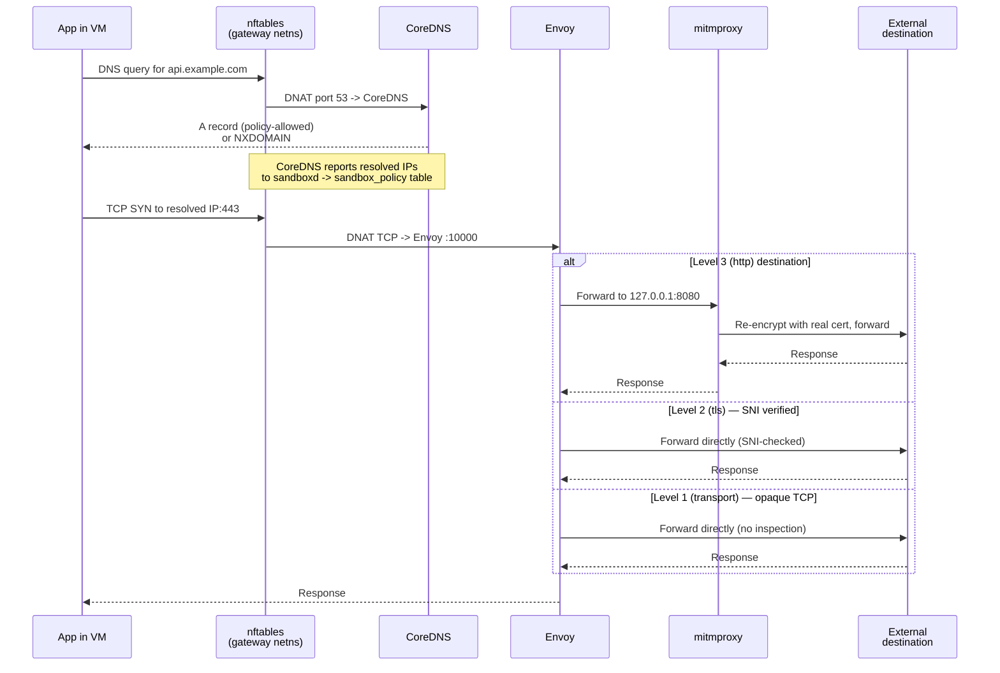

Every sandbox session gets its own network stack with a single exit: the gateway container. This page explains the model — what exists, why, and how a packet travels from inside the VM to the internet. For hands-on rule writing, see [network policies](/guides/network-policies/).

## The model in one picture

Each session is a closed loop:

- A **per-session Docker bridge** (a `/28` subnet) — the only L2 segment the VM touches.
- A **gateway container** attached to that bridge — the only L3 next hop the VM can reach.
- Inside the gateway: **nftables** for default-deny firewalling and DNAT, **CoreDNS** for policy-filtered DNS, **Envoy** for connection routing, **mitmproxy** for TLS inspection.
- A **per-session CA** trusted inside the VM, with the private key living only inside the gateway.

There is no alternate path out for application traffic. The VM's data NIC routes through the gateway, and the gateway denies everything by default.

## The two NICs: management vs. data plane

Each VM has two network interfaces, with very different roles:

| Interface | Type | Carries | Reaches |
|---|---|---|---|
| `eth0` | SLIRP (QEMU user-mode networking) | Lima's SSH management channel | The host, via QEMU's in-process TCP/IP stack |
| `eth1` | TAP on the per-session Docker bridge | All application traffic | The gateway container — and nothing else |

`eth0` exists because Lima needs an SSH channel to the VM and SLIRP provides one without requiring TAP devices or root on the host. It is **not** a path for user workloads: the guest installs a default route over `eth1` with a lower metric than SLIRP's, so any `connect()` from an application inside the VM goes out through the gateway, not through SLIRP. The SLIRP interface is effectively invisible to applications running inside the VM.

This matters for the threat model: the policy layer (DNS filtering, nftables, Envoy, mitmproxy) applies to traffic that reaches the gateway. That covers the entire data plane by construction. SLIRP carries only the Lima management channel; it doesn't and can't carry application traffic to arbitrary internet destinations. See [SLIRP management network](/guides/hardening/#slirp-management-network) in the hardening guide for the trade-offs this design makes.

## Per-session isolation

### One bridge per session

When you create a session, sandboxd allocates a `/28` subnet from a configurable base (default `10.209.0.0/24`). A `/24` holds 16 concurrent sessions.

| Address in the `/28` | Role |
|---|---|
| `.1` | Docker bridge gateway (the bridge itself) |
| `.2` | Gateway container |
| `.3` | VM data NIC |
| `.4`–`.14` | Unused |

Because each session has its own bridge — a separate L2 segment — sessions cannot see each other's traffic. The gateway container attaches only to that session's bridge, so it has no visibility into the host network or other sessions either.

### The naming scheme

Session IDs are 12 lowercase hex characters, chosen so the derived network-resource names fit Linux's 15-character interface name limit exactly:

| Resource | Name |
|---|---|
| Docker network | `sandbox-net-{session_id}` |
| Bridge interface | `sb-{session_id}` (3 + 12 = 15) |
| Gateway container | `sandbox-gw-{session_id}` |
| TAP device | `tb-{session_id}` (3 + 12 = 15) |

## The gateway

The gateway container is the session's single exit. It runs three cooperating processes plus an nftables ruleset in its own network namespace.

### nftables

The gateway holds four nftables tables, each with a distinct role:

| Table | Purpose |
|---|---|
| `sandbox` | Deny-all baseline — forward chain drops everything |
| `sandbox_dnat` | PREROUTING DNAT — DNS to CoreDNS, TCP to Envoy |
| `sandbox_policy` | Allow rules for IPs learned from DNS responses |
| `sandbox_l3` | DNAT for L3 MITM — redirects HTTPS to mitmproxy |

The deny-all baseline is the safety net. Traffic reaches the internet only after being matched by the DNAT rules, forwarded to a gateway component, and allowed out by the policy-driven `sandbox_policy` table.

### Three processes

| Component | What it does |
|---|---|
| **CoreDNS** | Answers all DNS queries; returns `NXDOMAIN` for anything the policy does not list |
| **Envoy** | Receives redirected TCP; routes connections per the policy's assurance level |
| **mitmproxy** | Terminates TLS with the per-session CA for HTTP-level inspection |

Startup is ordered to avoid a window where traffic could leak: mitmproxy comes up first, then Envoy, then CoreDNS. The DNAT rules in `sandbox_dnat` are installed only after all three pass their readiness checks.

### Why a container, not the host

Running the gateway as a container keeps the daemon userland: sandboxd itself needs no root, no sudo, no host-level nftables access. The gateway has `CAP_NET_ADMIN` only inside its own network namespace, and the daemon edits rules with `docker exec nft` — not via privileged host tooling.

## Request flow

Two things are worth highlighting:

- **DNS is intercepted twice.** The VM's `resolv.conf` points at the gateway, *and* nftables DNATs port 53 regardless of destination. An application that ignores `resolv.conf` and hardcodes `8.8.8.8` still ends up at CoreDNS.
- **Direct-IP access is not a loophole.** Even if an application skips DNS and dials an IP directly, it hits the `sandbox_policy` table. Unless the IP is already in the allow list (from a policy CIDR rule or a recent CoreDNS answer), the packet is dropped.

## DNS

CoreDNS is the only resolver the VM reaches.

- **With a policy applied**, CoreDNS answers only the domains the policy lists; everything else returns `NXDOMAIN`. ECH/HTTPS SVCB records are stripped from answers so Encrypted Client Hello cannot hide the hostname from downstream inspection.
- **Without a policy**, DNS resolution returns `NXDOMAIN` for everything — the default is deny.
- **IPs learned from CoreDNS** are reported back to sandboxd, which writes them into the `sandbox_policy` table so the firewall matches the live IPs for each allowed domain.

## TLS interception

The sandbox inspects HTTPS traffic at the highest policy level by generating a per-session CA and letting mitmproxy man-in-the-middle intercepted flows.

### Per-session CA

At session creation, sandboxd generates an ECDSA P-256 CA. The CA's Common Name is `Sandbox CA {session_id}`. CA files live in the session's state directory and are bind-mounted read-only into the gateway.

The **private key never enters the VM.** The VM receives only the public certificate, installed in:

- The system trust store (`/usr/local/share/ca-certificates/`, refreshed with `update-ca-certificates`).
- Per-language trust-store environment variables (`SSL_CERT_FILE`, `REQUESTS_CA_BUNDLE`, `NODE_EXTRA_CA_CERTS`, `CURL_CA_BUNDLE`).
- The Docker daemon trust store inside the VM, for registry pulls.

Each session uses its own CA. Compromise of one session's CA does not affect others.

### What breaks under interception

Applications that pin certificates — or ship a private trust store — will reject the session CA. Those destinations need a lower assurance level (`tls` or `transport`) that skips MITM. See [policy model](/concepts/policy-model/) for what each level does.

## Lifecycle implications

Networking is created and destroyed with the session, in a specific order:

- **Create.** CA first, then the Docker bridge, then the gateway container with deny-all rules, then readiness, then DNAT rules, then the VM itself.
- **Stop.** VM down, gateway down, bridge removed. The subnet allocation and the CA are preserved so `start` can restore the same addressing and trust chain.
- **Start.** The stored subnet and IPs are reused; a new gateway container is created with the existing CA.
- **Remove.** Everything released, including the CA files.

See [sessions](/concepts/sessions/) for the broader lifecycle picture.

## Related reading

- [Policy model](/concepts/policy-model/) — how assurance levels map onto the components above.
- [Architecture](/concepts/architecture/) — how the gateway fits into the rest of the system.
- [Network policies guide](/guides/network-policies/) — authoring and applying rules.
- [Hardening](/guides/hardening/) — the security properties this network model enforces.
- [Troubleshooting](/guides/troubleshooting/) — diagnosing network failures in a running session.
