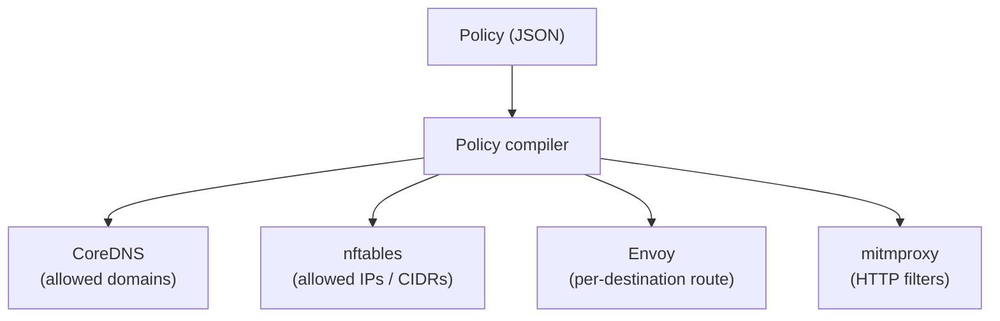

A network policy is the contract between you and a sandbox session: what the agent inside can reach on the network, and how deeply each destination is inspected. This page explains the model. For writing and applying policies, see the [network policies guide](/guides/network-policies/). For what the enforcement infrastructure actually does, see [networking](/concepts/networking/).

## Default is deny

A session without a policy has no outbound connectivity:

- DNS returns `NXDOMAIN` for every query.
- nftables drops every forwarded packet.
- The gateway blocks everything that somehow makes it past the first two layers.

A policy is additive — each rule opens a specific hole. "Deny" is not something you normally write; it is the ambient state.

## Assurance levels

Every rule declares an **assurance level** — how much visibility and control the sandbox has over matching traffic. Four levels, from least to most intrusive:

| Level | Name | What happens | Typical use |
|---|---|---|---|
| 0 | `deny` | Block. Useful as a narrow override inside a broader rule. | Carving an exception out of a wildcard. |
| 1 | `transport` | Opaque TCP passthrough. No inspection. | Package registries, source control — anything that pins certificates. |
| 2 | `tls` | TLS passthrough with SNI verification against the policy. No MITM. | APIs where you want to verify the hostname but preserve end-to-end TLS. |
| 3 | `http` | Full HTTPS interception via mitmproxy. Per-request method-and-path filtering. | APIs where you want to restrict which HTTP verbs and paths the agent can call. |

Higher levels cost more — a `http` rule terminates and re-encrypts TLS, a `transport` rule just forwards bytes — but give finer-grained control.

### Why not always pick the highest level

Because level 3 requires mitmproxy to impersonate the server, and the client has to trust the per-session CA. Any destination that pins certificates or ships its own trust store breaks under interception. `tls` and `transport` exist precisely to handle those destinations without failing.

## Rule shape

A policy is a JSON document with a `version` and an ordered `rules` array.

```json
{
  "version": "1.0.0",
  "rules": [
    {
      "destination": "api.example.com",
      "level": "tls",
      "protocol": "https",
      "reason": "Example API access"
    }
  ]
}
```

### Fields

| Field | Required | Meaning |
|---|---|---|
| `destination` | yes | Domain, wildcard domain (`*.example.com`), IP, or CIDR |
| `level` | yes | `deny`, `transport`, `tls`, or `http` |
| `protocol` | no | `tcp`, `udp`, `http`, `https`, `any` (default `any`) |
| `http_filters` | conditional | `(method, path)` pairs — **required** at level `http`, forbidden elsewhere |
| `reason` | no | Free-form explanation |

### Destinations

- **Exact domain:** `"github.com"` — just that host.
- **Wildcard domain:** `"*.github.com"` — subdomains only, not the apex. To cover both, list both.
- **IP:** `"140.82.112.4"` — single address.
- **CIDR:** `"140.82.112.0/20"` — range.

Wildcards only work as a `*.` prefix. Domain labels must follow DNS rules.

### HTTP filters

At level `http`, a rule must carry `http_filters`: an ordered list of `(method, path)` pairs.

- **Method:** an uppercase HTTP verb (`GET`, `POST`, ...) or the wildcard `ANY`.
- **Path:** an fnmatch glob (`*`, `?`, `[...]`).

A request is allowed when at least one filter's method **and** path both match. Because method and path live inside the same object, you can express mixed pairs precisely:

```json
"http_filters": [
  {"method": "GET",  "path": "/api/v1/*"},
  {"method": "POST", "path": "/api/v1/write/*"}
]
```

That is not the cartesian product of `{GET, POST} x {/api/v1/*, /api/v1/write/*}` — it is exactly two pairs. Independent method and path lists cannot express this.

The array must be non-empty. An empty list would make the rule unreachable, and the compiler rejects it.

### Validation rules

The policy compiler rejects a policy if:

- The major `version` does not match.
- `http_filters` appear on a rule whose level is not `http`.
- A level-`http` rule is missing `http_filters`, or uses a protocol incompatible with HTTP.
- A CIDR is syntactically invalid.
- A domain name violates DNS label rules.
- Two rules name the same destination with different levels — treated as a contradiction.

## How each level maps onto enforcement

Policies are compiled down into configuration for four components. Each level exercises a specific subset.



- **CoreDNS** receives the allow-list of domains. Allowed names resolve normally; everything else returns `NXDOMAIN`. Resolved IPs are fed back to sandboxd to keep nftables current.
- **nftables** blocks traffic to any IP not covered by the policy (either a CIDR literal or a DNS-learned IP). Default-deny; one rule's worth of opening per allowed destination.
- **Envoy** receives all TCP that survives the firewall and picks a route per level: passthrough for `transport`, SNI-verified passthrough for `tls`, mitmproxy handoff for `http`.
- **mitmproxy** handles only `http` traffic. It terminates TLS with the per-session CA, matches the request against the rule's `http_filters`, and either forwards or rejects with a 599 response carrying the denial reason.

The practical consequence: a `transport` rule touches three components (DNS, nftables, Envoy) and a `http` rule touches all four. Moving a rule to a higher level does not add access — it adds inspection.

## Applying policies

Policies are a property of a session. You attach one at creation with `--policy <file>` and update it live with `sandbox policy update`. The update path re-compiles and hot-reloads all four components without restarting the session. See the [network policies guide](/guides/network-policies/) for the commands.

For debugging what the active policy allows, `sandbox describe` prints a human summary and `sandbox inspect` returns the full JSON representation. See the [CLI reference](/reference/cli/) for output shapes.

## Related reading

- [Network policies guide](/guides/network-policies/) — write a policy, apply it, troubleshoot denials.
- [Networking](/concepts/networking/) — the infrastructure the compiler targets.
- [Hardening](/guides/hardening/) — where policy fits into the broader security posture.
