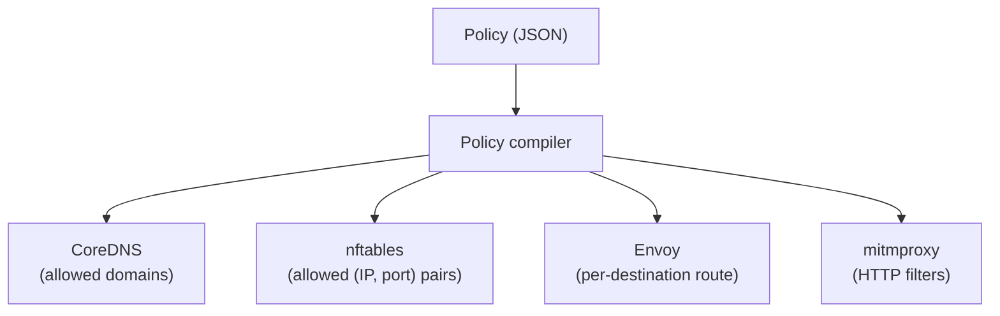

A network policy is the contract between you and a sandbox session: what the agent inside can reach on the network, and how deeply each destination is inspected. This page explains the model. For writing and applying policies, see the [network policies guide](/sandboxd/guides/network-policies/). For what the enforcement infrastructure actually does, see [networking](/sandboxd/concepts/networking/).

## Default is deny

A session without a policy has no outbound connectivity:

- DNS returns `NXDOMAIN` for every query.
- nftables drops every forwarded packet.
- The gateway blocks everything that somehow makes it past the first two layers.

A policy is additive — each rule opens a specific hole. "Deny" is not something you normally write; it is the ambient state.

## Assurance levels

Every rule declares an **assurance level** — how much visibility and control the sandbox has over matching traffic. Four levels, from least to most intrusive:

| Level | Name | What happens | Typical use |
|---|---|---|---|
| 0 | `deny` | Block. Useful as a narrow override inside a broader rule. | Carving an exception out of a wildcard. |
| 1 | `transport` | Opaque TCP passthrough. No inspection. | Package registries, source control — anything that pins certificates. |
| 2 | `tls` | TLS passthrough with SNI verification against the policy. No MITM. | APIs where you want to verify the hostname but preserve end-to-end TLS. |
| 3 | `http` | Full HTTPS interception via mitmproxy. Per-request method-and-path filtering. | APIs where you want to restrict which HTTP verbs and paths the agent can call. |

Higher levels cost more — a `http` rule terminates and re-encrypts TLS, a `transport` rule just forwards bytes — but give finer-grained control.

### Why not always pick the highest level

Because level 3 requires mitmproxy to impersonate the server, and the client has to trust the per-session CA. Any destination that pins certificates or ships its own trust store breaks under interception. `tls` and `transport` exist precisely to handle those destinations without failing.

## Rule shape

A policy is a JSON document with a `version` and an ordered `rules` array. Every rule names the `(host, port, protocol)` tuple it allows at a given assurance level.

```json
{
  "version": "2.0.0",
  "rules": [
    {
      "host": "api.example.com",
      "port": 443,
      "protocol": "tcp",
      "level": "tls",
      "reason": "Example API access"
    }
  ]
}
```

The `version` field is the **schema version** of the document format — it tells the daemon which policy DTO shape the file conforms to. The current schema is `2.0.0`; minor bumps (`2.x.x`) are accepted as backward-compatible, and the major must match exactly. It is *not* a per-policy revision counter — editing a policy does not require bumping `version`. Per-policy identity is tracked separately by the daemon as `policy_hash`, the SHA-256 digest of the canonical JSON form, surfaced on the `policy_propagated` and `policy_updated` lifecycle events and as `expected_hash` / `propagated_hash` on `GET /sessions/{id}/policy/propagation-status` (see [networking → Synchronous DNS-policy gating](/sandboxd/concepts/networking/#synchronous-dns-policy-gating)).

### Fields

| Field | Required | Meaning |
|---|---|---|
| `host` | yes | Domain, wildcard domain (`*.example.com`), IP, or CIDR. Bare `*` is rejected. |
| `port` | yes | L4 port number, `1..=65535`. No ranges, no lists. |
| `protocol` | yes | L4 protocol — `tcp` or `udp`. No other values are accepted. |
| `level` | yes | `deny`, `transport`, `tls`, or `http` |
| `http_filters` | conditional | `(method, path)` pairs — **required** at level `http`, forbidden elsewhere |
| `reason` | no | Free-form explanation |

Rule identity is the `(host, port)` pair: at most one rule per pair in any effective policy.

#### UDP-specific caveats

The `protocol` enum accepts `tcp` or `udp` symmetrically, but the two protocols carry different operational properties:

- **No L7 inspection for UDP.** mitmproxy does not handle UDP and there is no equivalent of HTTP CONNECT — the only meaningful level for `protocol: "udp"` is `transport`. The policy compiler rejects level `http` paired with `protocol: "udp"` (and `tls` with UDP is similarly not viable). Allowed UDP exits the gateway directly through nftables MASQUERADE, with no userland proxy on the data path.
- **Allow audit is per-flow, not per-packet.** Every accepted UDP flow produces one `event: "allow"` JSONL record at flow start, sourced from the kernel's conntrack `NFCT_T_NEW` event. A long-lived UDP exchange does not produce one record per datagram. Conntrack ages the flow out after 30 s of silence (`net.netfilter.nf_conntrack_udp_timeout`); the next packet on the same 5-tuple opens a new flow with a new allow record. TCP allow audit, by contrast, is per-connection via Envoy's access log.
- **Deny is silent at the network level.** A blocked UDP datagram is dropped at nft with no ICMP unreachable on the wire — the VM-side socket sees only timeouts. Audit attribution lives in the JSONL stream: a `event: "deny"` record carrying the original 5-tuple is written by `sandbox-nft-deny-logger` from the kernel's NFLOG group 1 stream. TCP deny, by contrast, is a RST close on a redirected listener socket.

These properties are also reflected in the [network policies guide](/sandboxd/guides/network-policies/#udp-destinations) (with a worked NTP example) and the [troubleshooting guide's UDP section](/sandboxd/guides/troubleshooting/#udp-traffic) (for diagnosis flow).

### Hosts

- **Exact domain:** `"github.com"` — just that host.
- **Wildcard domain:** `"*.github.com"` — subdomains only, not the apex. To cover both, list both.
- **IP:** `"140.82.112.4"` — single address.
- **CIDR:** `"140.82.112.0/20"` — range.

Wildcards only work as a `*.` prefix. A bare `*` is not a valid host; to allow a port broadly, pair it with `0.0.0.0/0` and be explicit about it. Domain labels must follow DNS rules.

### HTTP filters

At level `http`, a rule must carry `http_filters`: an ordered list of `(method, path)` pairs.

- **Method:** an uppercase HTTP verb (`GET`, `POST`, ...) or the wildcard `ANY`.
- **Path:** a per-segment glob, anchored to the full request path.

Path matcher semantics:

- `**` matches any run of characters, including `/` — crosses path segments.
- `*` matches any run of non-`/` characters — stays inside a single segment.
- `?` matches exactly one non-`/` character.
- Literals match themselves.

A request is allowed when at least one filter's method **and** path both match. Because method and path live inside the same object, you can express mixed pairs precisely:

```json
"http_filters": [
  {"method": "GET",  "path": "/api/v1/**"},
  {"method": "POST", "path": "/api/v1/write/**"}
]
```

That is not the cartesian product of `{GET, POST} x {/api/v1/**, /api/v1/write/**}` — it is exactly two pairs. Independent method and path lists cannot express this.

The array must be non-empty. An empty list would make the rule unreachable, and the compiler rejects it.

### Validation rules

The policy compiler rejects a policy if:

- The major `version` does not match.
- Any rule omits `host`, `port`, or `protocol`, or uses `protocol` values other than `tcp` / `udp`.
- A `host` is a bare `*`.
- `http_filters` appear on a rule whose level is not `http`.
- A level-`http` rule is missing `http_filters`.
- A CIDR is syntactically invalid.
- A domain name violates DNS label rules.
- Two rules share the same `(host, port)` pair with different levels — treated as a contradiction.

## How each level maps onto enforcement

Policies are compiled down into configuration for four components. Each level exercises a specific subset.



- **CoreDNS** receives the allow-list of domains. Allowed names resolve normally; everything else returns `NXDOMAIN`. Resolved IPs are fed back to sandboxd to keep nftables current.
- **nftables** blocks traffic to any `(destination-IP, destination-port)` pair not covered by the policy — populated from CIDR literals (expanded to `/32` entries for resolved IPs of a domain, or the CIDR itself for literal rules) crossed with the rule's explicit port. TCP that doesn't match is DNAT-redirected to the nft-deny-logger's listener, which RST-closes the flow and emits a structured `deny` event. UDP that doesn't match is dropped at nft (silent — no ICMP unreachable) with a NFLOG group 1 audit copy that the nft-deny-logger consumes from the kernel and emits as the same `deny` event shape.
- **Envoy** receives all TCP that survives the firewall and picks a filter chain whose `filter_chain_match` combines `prefix_ranges` (destination IPs) with an explicit `destination_port`. The chain then routes per level: passthrough for `transport`, SNI-verified passthrough for `tls`, loopback CONNECT to mitmproxy for `http`.
- **mitmproxy** handles only `http` traffic. It terminates TLS with the per-session CA, strips the query string from the request path, matches against the rule's `http_filters`, and either forwards or rejects with a 599 response carrying the denial reason.

The practical consequence: a `transport` rule touches three components (DNS, nftables, Envoy) and a `http` rule touches all four. Moving a rule to a higher level does not add access — it adds inspection.

Because every rule carries an explicit port and protocol (v2 policy schema), every layer matches on the same `(destination, port, protocol)` tuple. An `api.example.com:443` rule does not inadvertently open `api.example.com:80` — a connection to port 80 would miss every layer's allow predicate and be denied.

## Applying policies

Policies are a property of a session. You attach one at creation with `--policy <file>` and/or one or more `--preset <invocation>` flags, and update them live with `sandbox policy update`. The update path re-compiles and hot-reloads all four components without restarting the session. See the [network policies guide](/sandboxd/guides/network-policies/) for the commands.

For debugging what the active policy allows, `sandbox describe` prints a human summary and `sandbox inspect` returns the full JSON representation. See the [CLI reference](/sandboxd/reference/cli/) for output shapes.

## Presets

Presets are reusable host-list templates that the CLI expands into v2 policy rules before the request ever reaches the daemon. Thirteen built-ins ship with every CLI release (`npm`, `pypi`, `cargo`, `goproxy`, `maven`, `gradle`, `dockerhub`, `docker`, `claude`, `github`, `github-repo`, `github-pr`, `ubuntu`), and user-defined JSON presets under `$XDG_CONFIG_HOME/sandboxd/presets/` extend the catalog for site-specific destinations.

Expansion is entirely client-side — the daemon receives the fully materialized effective policy and stores the original `--preset` invocation strings as a `source_presets` audit trail attached to the `policy_applied` / `policy_updated` events. See the [network policies guide → Presets](/sandboxd/guides/network-policies/#presets) for invocation syntax, built-in catalog, and user-preset authoring rules.

## Observability

Every policy-enforcing component (CoreDNS, Envoy, mitmproxy, nft-deny-logger, nft-allow-logger) emits a structured event per decision, and sandboxd itself emits lifecycle events — including `policy_applied`, `policy_updated`, `policy_propagated`, `gateway_ready`, and `gateway_shutdown`. All of them land in a unified per-session stream you can replay or follow with `sandbox events <session>`. The `policy_propagated` event in particular closes the DNS-propagation window: it fires once the applied policy's hash has reconciled across CoreDNS, the nftables `policy_allow_{tcp,udp}` sets, and Envoy's L3 filter chains. See [`sandbox events`](/sandboxd/reference/cli/#sandbox-events) for the full CLI surface and [networking → Synchronous DNS-policy gating](/sandboxd/concepts/networking/#synchronous-dns-policy-gating) for why the propagation is observable at all.

Note the asymmetry between TCP and UDP audit granularity: TCP allow events come from Envoy's access log (per connection), TCP deny events come from `nft-deny-logger`'s redirected listener (per accepted-then-RST-closed connection), UDP allow events come from `nft-allow-logger`'s NFCT subscription (per new conntrack flow, with 30 s rollover after silence), and UDP deny events come from `nft-deny-logger`'s NFLOG subscription (per dropped datagram, no ICMP attribution on the wire). Per-protocol caveats are spelled out alongside the [`protocol` field](#udp-specific-caveats) above.

## Related reading

- [Network policies guide](/sandboxd/guides/network-policies/) — write a policy, apply it, troubleshoot denials.
- [Networking](/sandboxd/concepts/networking/) — the infrastructure the compiler targets.
- [Hardening](/sandboxd/guides/hardening/) — where policy fits into the broader security posture.
