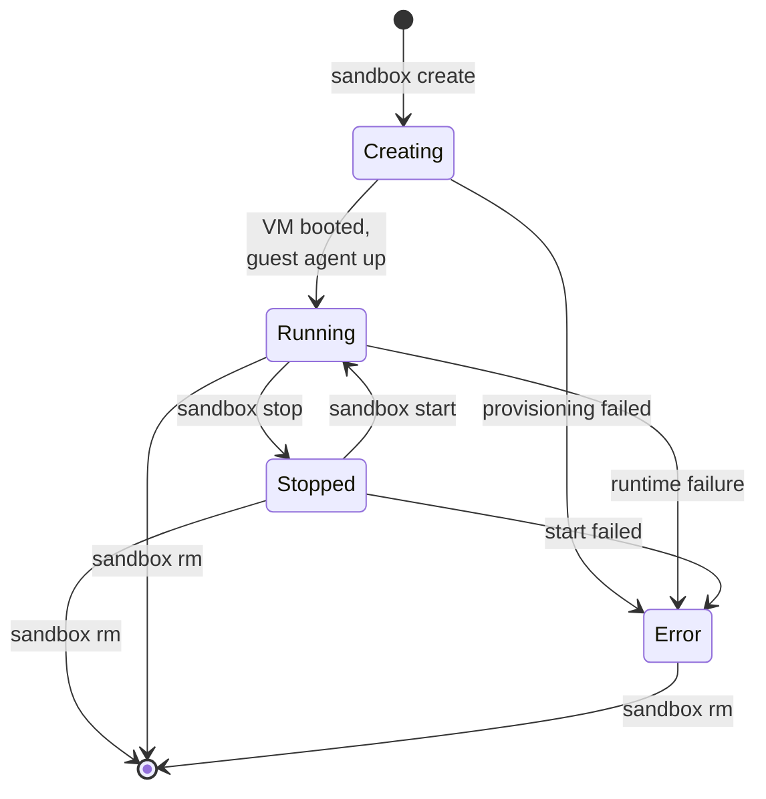

A **session** is the unit of isolation in sandboxd. Every session is one Linux VM plus its own gateway container, its own Docker bridge, its own CA, and its own network policy. You talk to a session through the daemon; the daemon tracks its state in a SQLite database so nothing is lost across daemon restarts.

This page explains the session model, the lifecycle, and which pieces survive across daemon restarts. For day-to-day commands, see the [CLI reference](/reference/cli/). For the underlying components, see [Architecture](/concepts/architecture/).

## What a session contains

When you run `sandbox create`, the daemon provisions a bundle of resources that all share a single session ID (12 lowercase hex characters, Docker-style):

- A **QEMU/KVM VM** managed by Lima, cloned from a pre-baked base image on the fast path.
- A **guest agent** (`sandbox-guest`) running inside the VM on TCP port 5123, reached over an SSH-tunneled connection.
- A **Docker bridge network** allocated from a private subnet range.
- A **per-session gateway container** running five processes — Envoy, mitmproxy, CoreDNS, sandbox-nft-deny-logger, and sandbox-nft-allow-logger — that together filter and audit every outbound packet from the VM.
- A **per-session CA certificate** generated on the host, injected into the VM's trust store, and used by mitmproxy to MITM TLS.
- An **applied policy** (optional) that constrains which destinations the VM can reach and at which assurance level.

All of this is session-scoped. Two sessions on the same host share nothing at runtime.

Sessions can be backed by one of two runtimes: a Lima/QEMU VM (the default, VM-grade isolation) or a Docker container (lite mode, container-level isolation, faster session creation). The session contract — gateway, policy, workspace, persistence — is identical across both. See [Lite mode](/guides/lite-mode/) for the trade-off and when to choose each.

## Identifiers

Every session has a 12-character lowercase-hex **session ID** (for example `550e8400e29b`). You can also give a session a human-readable `--name` at creation time. Commands that take a `<session>` argument accept:

- the full session ID,
- any unique prefix of the session ID (Docker-style), or
- the session's `--name`.

See the [CLI reference](/reference/cli/) for the prefix-disambiguation rules.

## Lifecycle

A session moves through four states. The daemon validates every transition — you cannot skip states, and `Error` is terminal.

### Creating

`sandbox create` inserts a new row in the store with state `Creating`, then:

1. Generates the per-session CA.
2. Creates the Docker bridge network.
3. Clones (fast path) or builds (slow path) the VM via Lima.
4. Starts the VM with bridge networking.
5. Installs the guest agent if the slow path was used.
6. Pings the guest agent until it responds.
7. Sets up the gateway container, injects the CA, and applies the initial policy if one was provided.

On success the state flips to `Running`. On any failure the daemon cleans up the VM, network, and CA, and the state flips to `Error`.

### Running

In `Running` state the VM is up, the guest agent is reachable, and the gateway is enforcing whatever policy is applied. You can:

- `sandbox exec <session> -- <cmd>` to run a non-interactive command.
- `sandbox ssh <session>` to open an interactive shell.
- `sandbox cp <src> <dst>` to copy files in or out.
- `sandbox policy update <session> ...` to change the active policy without restarting the VM.
- `sandbox logs <session>` to stream gateway logs.

### Stopped

`sandbox stop` tears down runtime networking (TAP detach, gateway stop, Docker-network remove) and halts the VM. The session row, its config, its persisted policy, and its subnet allocation all stay in the store so `sandbox start` can bring it back without re-provisioning.

### Error

`Error` is terminal. The daemon sets this when a provisioning step fails irrecoverably or when an in-flight transition (start/stop) cannot complete cleanly. The only valid action on an `Error` session is `sandbox rm`.

## Persistence

Session state lives in `{base_dir}/sessions.db` (SQLite), where `{base_dir}` defaults to `$XDG_DATA_HOME/sandboxd` or `~/.local/share/sandboxd`. The following survives a daemon restart:

| Stored data | Survives restart | Notes |
|---|---|---|
| Session row (ID, name, state, timestamps) | yes | Reconciled against Lima inventory on daemon startup. |
| `SessionConfig` (CPUs, memory, disk, hardened, workspace mode, repo, boot-cmd, template) | yes | JSON blob in `config_json`. New fields are `Option<T>` with `#[serde(default)]` for forward/backward compatibility. |
| Network info (bridge name, subnet, MAC) | yes | So `start` can recreate networking without reallocating. |
| Applied policy | yes | Persisted alongside the session so restart restores the effective rules. |
| In-memory DNS-propagation loop | no | Rebuilt by the daemon when the session is started. |
| Guest-agent TCP connection | no | Re-established on demand. |

On startup, the daemon reconciles the store against Lima's VM inventory. If the store says `Running` but Lima cannot find the VM, the session is marked `Error`. If the store and Lima disagree on running vs. stopped, the store is updated to match reality.

For the full compatibility rules for evolving the stored schema, see `CLAUDE.md` under "On-disk compatibility".

## Stop vs. remove

These are not the same operation:

- **Stop** halts the VM, preserves the session row and its config, releases the bridge container but keeps the subnet allocated. You get a fast restart with `sandbox start`.
- **Remove** deletes the VM from Lima, tears down all networking, removes the CA, and deletes the session row. The subnet allocation is released and the session ID is gone.

Use `stop` when you want to pause a session overnight; use `rm` when you are done with it for good.

## What to read next

- [Architecture](/concepts/architecture/) — how the daemon, VM, guest agent, and gateway fit together.
- [Workspaces](/concepts/workspaces/) — how source code gets into a session.
- [Policy model](/concepts/policy-model/) — what an applied policy actually does.
- [CLI reference](/reference/cli/) — every command and flag.
