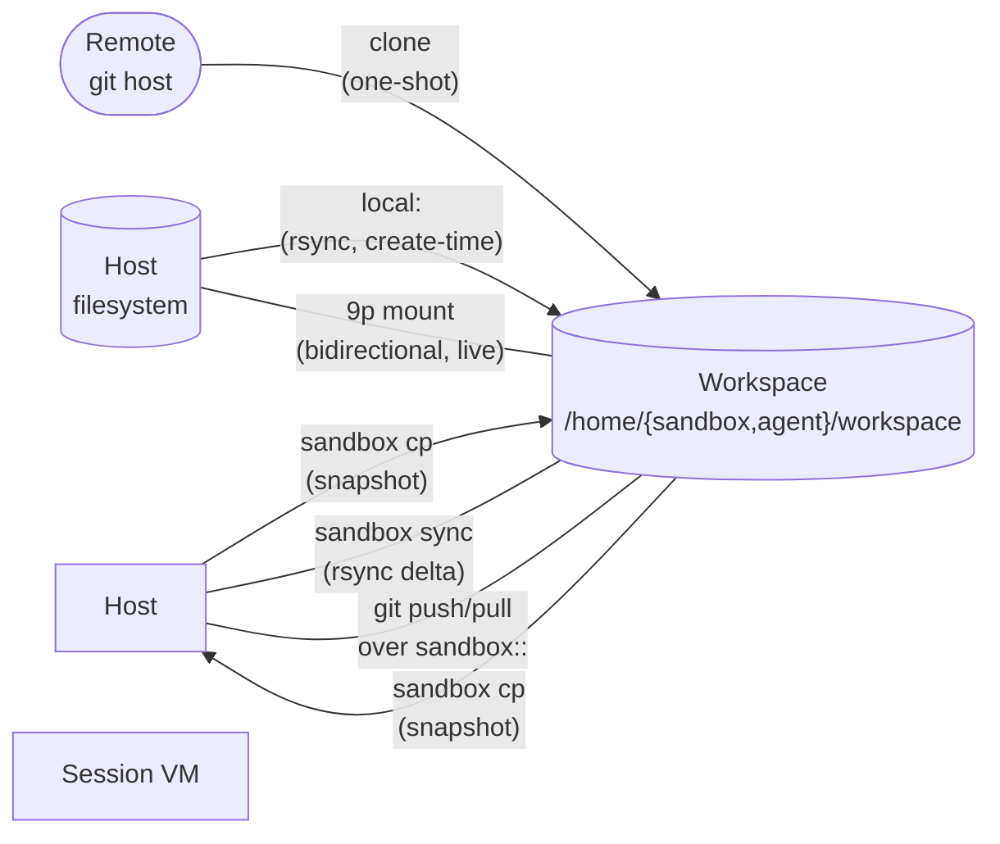

A workspace is whatever source code and project files a session can see. sandboxd offers six ways to get those files into — and out of — a VM, and the choice has real isolation consequences. This page explains the model. For hands-on commands, see the [workspaces guide](/sandboxd/guides/workspaces/).

## Why multiple modes

A coding agent needs a place to read source, write changes, and hand results back. Those three needs pull in different directions:

- **Isolation** wants the VM's filesystem to stay fully contained — no host path ever reachable from inside.
- **Latency** wants changes to appear immediately on both sides, without a copy step.
- **Bandwidth** wants to move only what changed, not a full re-sync each time.

No single mechanism wins on all three. sandboxd exposes six modes so you can pick the trade-off that fits the workload.

## The six modes

| Mode | Direction | Latency | Isolation |
|---|---|---|---|
| **Clone** | One-shot pull from a remote git host | Minutes (network-bound) | Full |
| **`local:` snapshot** | One-shot rsync from a host directory at create time | Per-create | Full |
| **Shared mount** | Bidirectional, live | Instant | Reduced — host directory exposed |
| **`sandbox cp`** | Bidirectional, per-transfer | Per-transfer | Full |
| **`sandbox sync`** | Bidirectional, rsync-driven directory sync | Per-operation, delta-only | Full |
| **Git remote transport** | Bidirectional, via `git push`/`git pull` | Per-operation | Full |

### Clone mode

At session creation, sandboxd runs `git clone` inside the session to pull a repository into the workspace directory (`/home/sandbox/workspace/` on both Lima and container sessions). The clone is a one-shot provisioning step — no ongoing link to the remote exists afterwards. Subsequent updates require either network access (permitted by policy) or one of the other modes.

Clone is the simplest model for CI-style workloads: the session starts with a known tree, runs some work, and is thrown away.

### `local:` snapshot

At session creation, sandboxd runs `rsync` from a host directory into a chosen guest path. The push is a one-shot provisioning step — after `sandbox create` returns, no live link to the host directory exists. The guest sees a static copy of the tree as it was at create time; the host is never visible to the guest's filesystem layer afterwards.

`local:` is the closer-to-shared cousin of `clone:`: it accepts a directory you already have on disk (no git remote, no policy rule for the git host) but, unlike `shared:`, does not attach a 9p device or bind-mount any host directory. The trade-off is staleness — keeping the guest's tree in step with subsequent host edits requires an explicit operator-triggered push or pull.

When to pick `local:`:

- Working from a non-git source tree (private packages, generated files, scratch directories) that you do not want to expose to the guest live.
- Want offline reproducibility — no clone race against an upstream remote.
- Want isolated work that does not echo back to the host until you explicitly pull. A guest-side write never reaches the host filesystem under `local:`.

Prefer `clone:` when a remote git URL is already the source of truth; prefer `shared:` when interactive live editing (IDE on host, build/test in guest) is the dominant flow.

See [hardening](/sandboxd/guides/hardening/#local-snapshot-workspace) for the security-trade-off notes behind picking `local:` over `shared:`.

### Shared mount

The host directory is mounted into the VM via QEMU's 9p filesystem. Reads and writes flow both ways in real time — the VM and the host see the same bytes with no sync step.

Shared mount trades isolation for developer ergonomics. The guest has read-write access to the chosen host directory, and 9p adds a filesystem-protocol surface reachable from inside the VM. See [hardening](/sandboxd/guides/hardening/) for the security-trade-offs section.

### `sandbox cp`

An explicit, scp-style copy between the host and a running session. The CLI dispatches the standard `scp` client against the [`sandbox-<id>` SSH alias](/sandboxd/concepts/ssh-access/) the daemon manages — uniformly across both backends — so each invocation is a point-in-time transfer with no persistent mount and no network exposure. Good for moving config files, build artifacts, or logs across the boundary without giving up isolation. The underlying transport is the daemon's `GET /sessions/{id}/proxy` WebSocket endpoint, so the data path is mediated by sandboxd's peercred-authenticated socket — no extra ports are opened on the host or in the gateway path.

### `sandbox sync`

A directory-level delta sync built on `rsync`, using standard `ssh` as the remote-shell transport (`rsync -a --delete -e ssh sandbox-<id>:...`) against the same managed SSH alias as `sandbox cp`. Unlike `sandbox cp`, it transfers only what changed between the source and destination trees and supports recursive directory copy with attribute preservation, includes/excludes, and dry-run via the trailing `-- <rsync-args>` slot. Use it when iterating on a host-side tree that needs to land inside a running session repeatedly without the cost of a full re-copy. The session must be running on both ends — the rsync remote-shell needs a live process to hand off to.

### Git remote transport

A git remote helper (`git-remote-sandbox`) that lets `git push` and `git pull` operate directly against a repository inside a running session. Git's pack protocol rides over the existing host-to-guest channel; no network policy, no open port.

This mode is designed for the common coding-agent loop: commit locally, push into the sandbox, build and test inside, pull results back.

## Data flow at a glance

All six modes land data in the guest's workspace directory. What differs is the channel and whether updates continue to flow after session creation.

## Isolation trade-offs

Only shared mount reduces the VM's isolation from the host; the other five modes preserve full isolation.

- **Clone** pulls bytes through the gateway at creation time, then closes the loop. The only lasting exposure is whatever the policy allows for network.
- **`local:` snapshot** runs `rsync` once during create over the daemon's per-backend control channel (`limactl shell` -> socat for Lima, `docker exec` -> socat for container). No 9p device is attached and no host directory is bound into the VM; after the push, the host is invisible to the guest's filesystem.
- **`sandbox cp`** dispatches `scp sandbox-<id>:...` against the [managed SSH alias](/sandboxd/concepts/ssh-access/) — the bytes ride the daemon's `GET /sessions/{id}/proxy` WebSocket endpoint, gated by the peercred-authenticated socket; no extra network exposure is opened on the host or in the gateway path.
- **`sandbox sync`** runs `rsync -e ssh sandbox-<id>:...` against the same managed alias, so the bytes ride the same daemon-mediated WebSocket. No SSH/rsync daemon is exposed to the network beyond the in-session sshd, which is loopback-bound inside the session's network namespace.
- **Git remote transport** works the same way: `git-remote-sandbox` invokes `sandbox ssh` internally, so the pack protocol rides the daemon proxy without opening anything new.
- **Shared mount** is different. QEMU's 9p filesystem exposes a directory live. The guest can write anything, at any time, to anything under that directory. A VM escape paired with 9p access expands the blast radius to those host files. See [hardening](/sandboxd/guides/hardening/#9p-shared-mounts) for the detailed security-model notes.

## Boot commands

Regardless of mode, you can run an arbitrary command inside the VM after provisioning finishes — `npm install`, `make setup`, whatever the project needs to become usable. Boot commands run as the `agent` user and run after the workspace is in place, so they can depend on the tree being present.

## Choosing a mode

- **Automating a job with a known start and end?** Clone — deterministic and throwaway.
- **Seeding a session from a local directory without giving up isolation?** `local:` — one-shot rsync snapshot, no 9p, no live link.
- **Interactively editing on the host with an IDE, building in the VM?** Shared mount — live bidirectional visibility is worth the isolation cost while you iterate.
- **Need to shuttle a one-off file across?** `sandbox cp` — no setup, full isolation.
- **Repeatedly syncing a directory tree, want delta-only transfer?** `sandbox sync` — rsync over the backend's control channel.
- **Commit-push-test-pull loop?** Git remote transport — the coding-agent native flow.

You can combine modes: clone at creation, then use `sandbox cp` or `sandbox sync` for artifacts, or bootstrap with git remote transport and use `sandbox cp` for logs. The modes are not exclusive — only `--repo` and `--workspace` (including `shared:` and `local:`) are mutually exclusive at session-creation time, because they both want to own the initial state of the guest workspace directory.

## Next steps

- [Workspaces guide](/sandboxd/guides/workspaces/) — commands and concrete flows for each mode.
- [Sessions](/sandboxd/concepts/sessions/) — how a workspace fits into the broader session lifecycle.
- [Networking](/sandboxd/concepts/networking/) — what clone mode needs from your policy.
